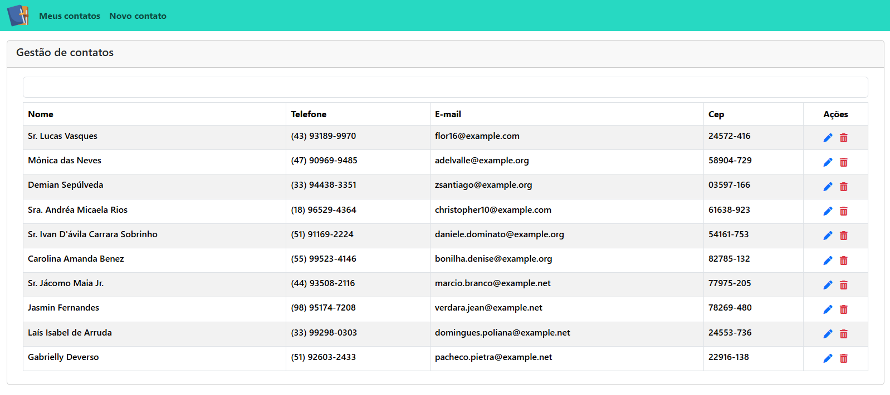
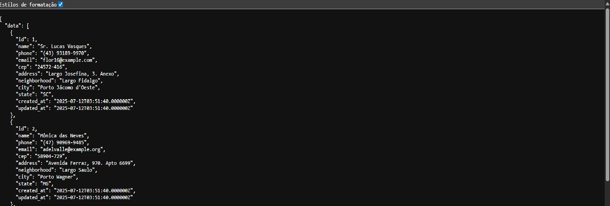
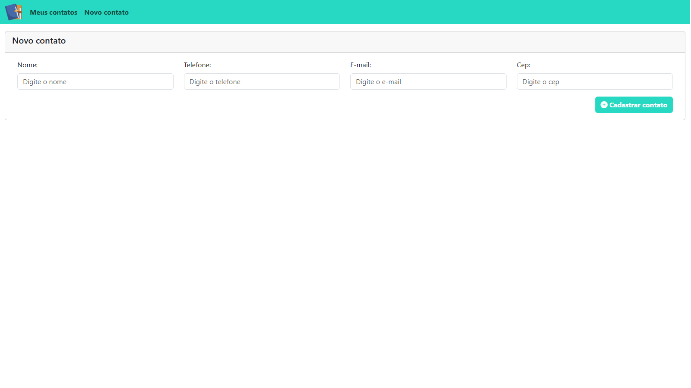
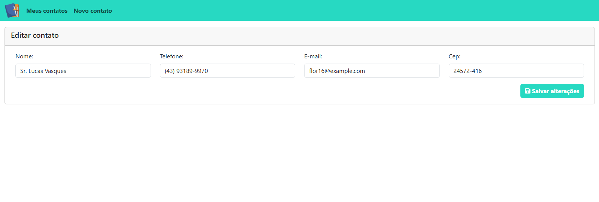

## 📘 Descrição

Avaliação técnica solicitada em 08/07/2025 com instruções de como rodar o projeto, como realizar testes e capturas de tela.

## 🛠️ Como rodar o projeto

1. Tenha o ambiente Docker parametrizado em sua máquina juntamente com virtualização e WSL.
2. Acesse o terminal em sua pasta de projetos do Docker e clone o repositório:
```bash
git clone https://github.com/gabrieltec97/avaliacao-tecnica.git
```
3. Altere para a pasta do projeto clonado:
```bash
cd avaliacao-tecnica
```
4. Copie o arquivo .env.example para .env:
```bash
cp .env.example .env
```
5. Abra uma IDE ou editor de código e parametrize as variáveis de banco de dados em seu arquivo .env:
```bash
DB_CONNECTION=mysql
DB_HOST=mariadb
DB_PORT=3306
DB_DATABASE=laravel
DB_USERNAME=root
DB_PASSWORD=password
```

Adicione ao final de seu arquivo .env:
```bash
WWWUSER=1000
WWWGROUP=1000

NODE_VERSION=20
MYSQL_CLIENT=mysql-client
POSTGRES_VERSION=16
```

6. Para que nossos testes funcionem, vamos parametrizar a criação de seu banco de dados:

No arquivo docker-compose.yml adicione esta linha em environment de mariadb:
```bash
MYSQL_ADDITIONAL_DATABASES: 'testing'
```

No arquivo phpunit.xml adicione dentro de <php>:
```bash
<env name="DB_CONNECTION" value="mysql"/>    
<env name="DB_HOST" value="mariadb"/>         
<env name="DB_PORT" value="3306"/>          
<env name="DB_DATABASE" value="testing"/>    
<env name="DB_USERNAME" value="root"/>       
<env name="DB_PASSWORD" value="password"/>   
```

Caso a aplicação não crie o banco de dados, acesse a aba de testes automatizados abaixo.

7. Instale as dependências com o Composer em seu ambiente Docker:
```bash
docker run --rm \
    -u "$(id -u):$(id -g)" \
    -v "$(pwd):/app" \
    composer install --ignore-platform-reqs
```
8. Gere a chave da aplicação:
```bash
docker run --rm \
    -v "$(pwd):/var/www/html" \
    php:8.3-fpm-alpine \
    php artisan key:generate
```
9. Suba os contêineres do projeto:
```bash
docker compose up -d
```

10. Rode as migrations e seeders necessárias para dar a configuração inicial para o sistema executar corretamente.
```bash
docker compose exec laravel.test php artisan migrate --seed
```
Ou caso você já esteja com seu ambiente parametrizado para utilizar o comando "sail" ou qualquer outro comando, utilize-o:
```bash
sail artisan migrate --seed
```
11. Pronto! Agora é só acessar http://localhost

## 🌐 - Endpoint de contatos
<p>Foi solicitado que fosse criado endpoint que retorne, em formato JSON, todos os contatos cadastrados. Acesse em:</p>

```bash
http://IP:PORT/api/contacts
```

## 🔧📦Testes automatizados

<h4>Para rodar nossos testes, precisaremos de um banco de dados de testes. Caso a aplicação não crie automaticamente, podemos criá-lo manualmente:</h4>

<h4>Caso você tenha uma ferramenta de administração de banco de dados como MySQL WorkBench ou Sequel Pro, basta se conectar ao banco e rodar o comando SQL:</h4>

```bash
CREATE DATABASE testing;
```

<h4>Caso não tenha, podemos criar diretamente com o Docker seguindo os passos abaixo:</h4>

<p>Com o terminal aberto dentro da pasta de nosso projeto, primeiro descubra o nome do seu container de banco de dados:</p>

```bash
docker ps
```

<p>Em seguida acesse o terminal onde nosso banco de dados está rodando (Se o nome original do projeto foi mantido, o nome do container será avaliacao-tecnica-mariadb-1):</p>

```bash
docker exec -it NOME_DO_SEU_CONTAINER_DE_DB bash
```

<p>Acesse o servidor MySQL/MariaDB:</p>

```bash
mariadb -u root -p
```

<p>Insira a senha: password</p>

<p>Crie o banco de dados:</p>

```bash
CREATE DATABASE testing;
```

<p>Dê o comando exit para sair do servidor MySQL/MariaDB:</p>

```bash
exit
```

<p>Dê o comando exit para sair do terminal onde o banco de dados está rodando:</p>

```bash
exit
```

Para rodar os testes dê o comando:
```bash
docker compose exec laravel.test php artisan test tests/Feature/ContactDestroyTest.php
```

Ou se você estiver com o laravel sail configurado:

```bash
sail artisan test tests/Feature/ContactDestroyTest.php
```
## 📸 Screenshots

<h4>Página principal com todos os contatos cadastrados, juntamente com o campo de busca e novo contato.</h4>



<h4>Retorno da rota de API solicitada no desafio.</h4>



<h4>Criação de novo contato.</h4>



<h4>Edição de contato.</h4>




